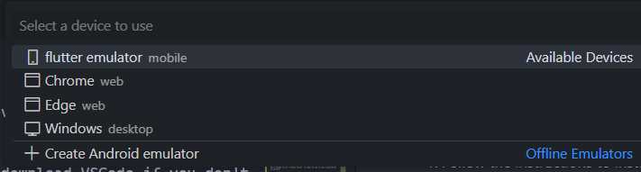
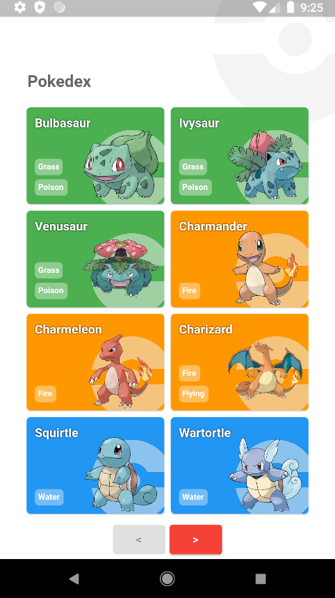
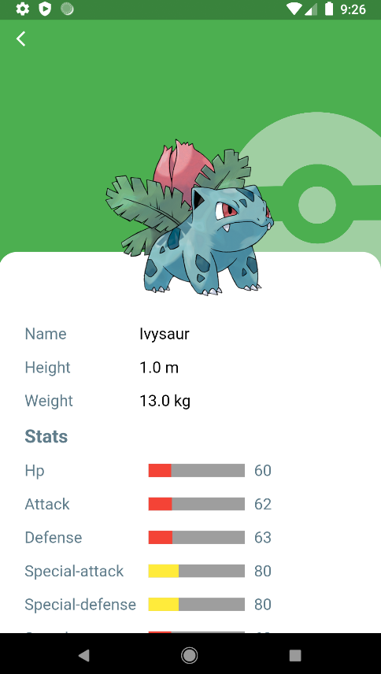
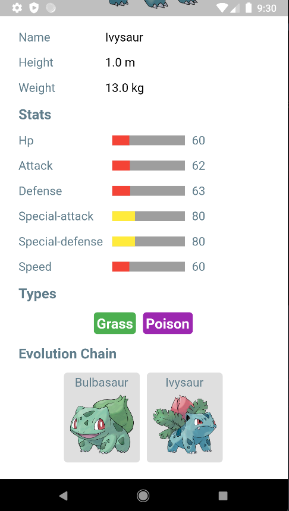

# Pokedex!

## Documentation

- [Introduction](#introduction)
- [Installation](#installation)
- [Limitations](#limitations)
- [Pokémon API](#pokémon-api)
- [Demo](#demo)

## Introduction

Hi! This is a project about showing an interactive Pokedex in a mobile version. This project was created using [Flutter](https://flutter.dev/), [Dart](https://dart.dev/) and [PokéApi](https://pokeapi.co/) (free pókemon API).

## Installation

### Requirements

- [Flutter](https://docs.flutter.dev/get-started/install)
- [JRE (Java 17)](https://www.oracle.com/java/technologies/downloads/#java17)
- [Android SDK (if you are using Windows)](https://developer.android.com/studio)
- [VSCode](https://code.visualstudio.com/Download)

### Steps

For every step, you can use the links from above (at [Requirements](#requirements)).

0. Download the code from this repository and download VSCode if you don't have it installed yet. You need to have VSCode installed in your machine for the following steps.
1. Follow the instructions to install Flutter (please visit the link above) on your system successfully. It can be installed in Windows, Mac and Linux.
2. Download and install JRE (java 17) using the link above at the requirements.
3. If you are using Windows, you can choose downloading Android Studio or Android SDK in order to get all the necessary requirements to simulate a mobile device.
4. Please, follow the [instructions](https://docs.flutter.dev/get-started/editor?tab=vscode) for setting up Flutter using VSCode. You need to install Flutter and Dart plugins.
5. Open your simulated device available at the bottom of the VSCode window:

If you don't have one, you can create a Device simulator:


6. You can start running and debugging the project by opening the `main.dart` file located at `lib` directory. If you have any problem, you can follow [the official instructions](https://docs.flutter.dev/development/tools/vs-code#running-and-debugging).

Don't forget to use `flutter doctor` in order to see if your installation is correct.


## Limitations

In order to save time, not every available endpoints from Pokemon API were consumed. The main fetched endpoints were:

- https://pokeapi.co/api/v2/pokemon
- https://pokeapi.co/api/v2/pokemon/{id_or_name}
- https://pokeapi.co/api/v2/pokemon-species/{id_or_name}
- https://pokeapi.co/api/v2/evolution-chain/{id}

## Pokémon API

This project uses the free [Pokémon API](https://pokeapi.co/) in order to get all the information about all Pokémons. If you want to know more, please check out the [API docs](https://pokeapi.co/docs/v2).

### Nested Nature

The Pokemon API used in this project has a **nested-link-nature**. This means this API provides us information about other API endpoints where there is more API endpoints to consume in order to get more information about everything related to Pokémons.

This is an example about the Nested Nature:

```json
// Info downloaded from 
// https://pokeapi.co/api/v2/pokemon?limit=15&offset=0
{
  "count": 1154,
  "next": "https://pokeapi.co/api/v2/pokemon?offset=2&limit=2",
  "previous": null,
  "results": [
    { 
        "name": "bulbasaur",
        // Below is another Endpoint 
        // to get more info about "bulbasaur"
        "url": "https://pokeapi.co/api/v2/pokemon/1/"
    },
    { 
        "name": "ivysaur",
        // Same as above 
        "url": "https://pokeapi.co/api/v2/pokemon/2/"
    },
    ...
  ]
}
```

### Issue with the Nested Nature

As you can see, we are consuming general information from Pokémons, but we are not getting specific information about the Pokémon rather than it's name and the other endpoint.

For this reason, if we want to get a list of Pokémons with their specific information, we need to consume the nested endpoints.

**For example:** If we want to get a list of 15 Pokémons with their details, we need to consume 16 endpoints (1 list Pokémon API + 15 specific Pokémon API).

The huge amount of endpoint calls results in a **_serious performance issue_** for a good UX/UI experience.

### Solution

The approach to solve this problem was too reuse a HTTP Client for every request to the Pokemon API. This helps to have only one connection for every pokemon.

This solution speeds the App performance and reduce the API requests from 100 ms to 10 ms (90% better).

## Examples

</img>
</img>
</img>

...
